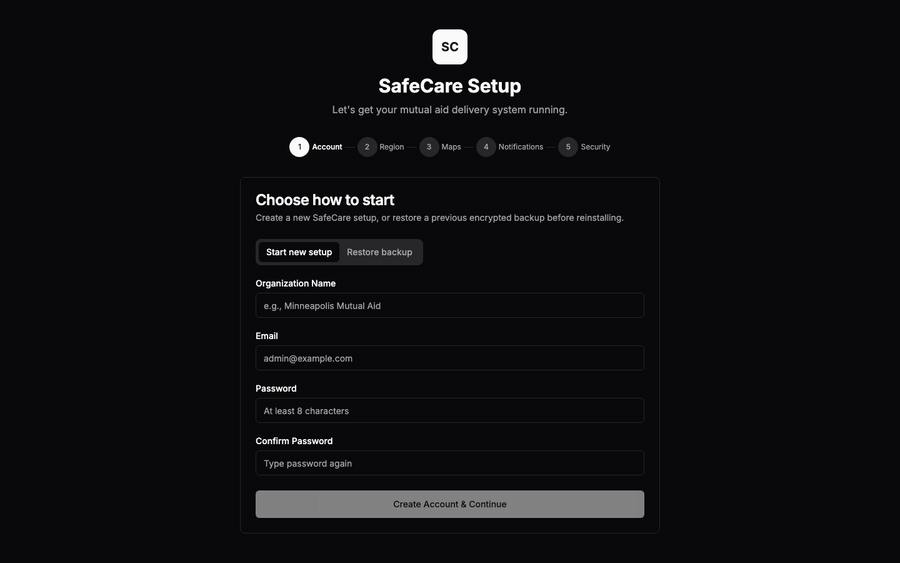
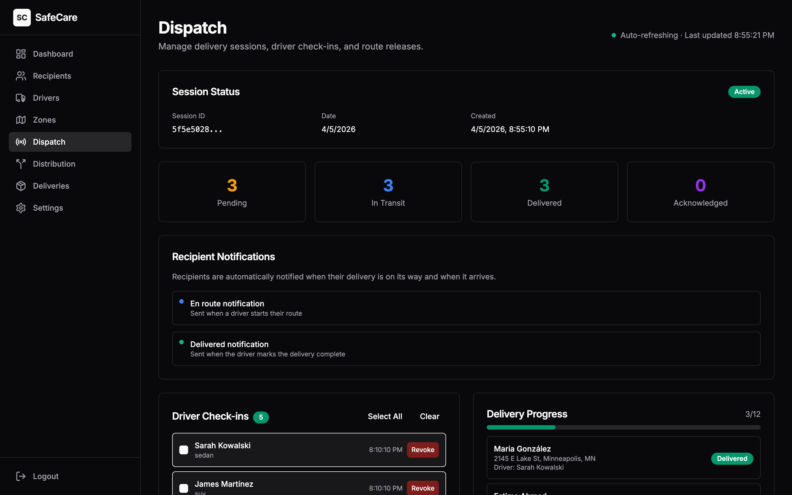

# SafeCare — Mutual Aid Delivery & Ride Coordination

A secure logistics platform for managing volunteer food deliveries and ride coordination for mutual aid communities. Prioritizes recipient privacy through field-level encryption, self-hosted geocoding and routing, and data compartmentalization.

Includes a **freestanding rideshare dashboard** for ride coordination, transit escorts, and a **vetted referral directory** that replaces "does anyone know a vet/attorney/mechanic?" messages in large group chats.



From a fresh install to a running dashboard in under 10 minutes — account creation, region selection, map download, WhatsApp pairing, and security briefing, all in a guided wizard with no command line required.

## How It Works

### Food Delivery

1. **Admin** sets up the operating region, adds recipients and drivers
2. **Admin** creates dispatch sessions, assigns deliveries, releases routes
3. **Drivers** check in via phone (PWA), download routes with offline maps, deliver
4. **Recipients** are notified in their language via Signal, SMS, or WhatsApp
5. **After delivery**, all route data is automatically purged from devices and server

### Ride Coordination

1. **Coordinator** creates ride schedules or processes incoming requests from the intake queue
2. **Shifts** appear on the shift board — drivers browse and claim rides
3. **Coordinator** confirms the claim; the driver gets the full address and contact info
4. **Vehicle status** (clean / flagged / unknown) gates which rides each driver can take
5. **Preferred pairings** are tracked — the system remembers who has driven whom before

### Referral Directory

1. **Admin** adds a vetted provider (vet, attorney, mechanic, clinic) with encrypted contact info
2. **Other admins vouch** — providers need 2+ vouches to appear in search
3. **Coordinators search** by category, neighborhood, language, or specialty instead of asking in group chats

Recipient addresses stay local: geocoding and routing run on your hardware, and delivered map tiles are served by the SafeCare server from local tile storage rather than loaded from third-party map CDNs at route time.

## Quick Start

### Option A: Raspberry Pi (recommended for deployment)

1. Download the image from [safecare.app/download](https://safecare.app/download) and flash it with [Raspberry Pi Imager](https://www.raspberrypi.com/software/)
2. Insert the card, plug in the Pi
3. Connect your phone to the **SafeCare-Setup** WiFi network
4. Walk through the setup wizard: WiFi, device password, encryption key (photograph the QR code!)
5. Open **http://safecare.local:3000** — scan your QR code to unlock, then create your account and define your region

No terminal, no command line, no technical knowledge needed.

### Option B: Developer setup

```bash
git clone https://github.com/safecare-project/safecare.git && cd safecare
bash scripts/setup.sh
cd docker && docker compose up -d
```

Open **http://localhost:3000** — a setup wizard walks you through creating your account, defining your operating region, and downloading map data.

**See [GETTING-STARTED.md](GETTING-STARTED.md) for the full guide** including screenshots, driver setup, notification configuration, and troubleshooting.

## Architecture

```
┌─────────────┐     ┌─────────┐     ┌────────────┐
│ Dashboard   │────▶│         │────▶│ PostgreSQL │
│ :3000       │     │ Backend │     │ (pgcrypto) │
└─────────────┘     │ :3001   │     └────────────┘
                    │         │
┌─────────────┐     │         ├──▶ Redis
│ Rideshare   │────▶│         │
│ :3002       │     │         ├──▶ OSRM (routing)
└─────────────┘     │         │
                    │         ├──▶ Nominatim (geocoding)
┌─────────────┐     │         │
│ Driver PWA  │────▶│         └──▶ Signal / WhatsApp
│ (offline)   │     └─────────┘
└─────────────┘
```

| Service | Port | Description |
|---------|------|-------------|
| Dashboard | 3000 | Delivery admin dashboard (Next.js) |
| Rideshare | 3002 | Ride coordination + referral directory (Next.js) |
| Backend | 3001 | REST API — serves both dashboards (Fastify) |
| PostgreSQL | 5432 | Encrypted database |
| Redis | 6379 | Jobs, settings, sessions |
| Nominatim | 8088 | Address geocoding |
| OSRM | 5000 | Driving directions |
| Signal | 8089 | E2E encrypted messaging |

Deploy one or both dashboards using Docker Compose profiles:

```bash
docker compose --profile safecare up -d    # delivery dashboard only
docker compose --profile rideshare up -d   # rideshare + referrals only
docker compose --profile full up -d        # both dashboards
```

## Key Features

### Delivery

- **Guided setup wizard** — 3-step first-run experience, no technical knowledge needed
- **Self-hosted maps** — OpenStreetMap data provisioned to your operating region
- **Address autocomplete** — self-hosted Nominatim geocoding (optional [TIGER data](docs/TIGER.md) for rural house-number accuracy)
- **Offline driver navigation** — map tiles and routes pre-cached on phones
- **Airplane mode prompts** — privacy reminder near delivery areas with loud audio alert at 500 m
- **Automatic data purge** — delivery records deleted + VACUUMed within 24 hours

### Ride Coordination

- **Shift board** — drivers browse and claim rides; coordinators confirm or reject
- **Recurring schedules** — weekly ride templates with auto-generated shifts
- **Vehicle status** — clean / flagged / unknown gates which rides each driver can take
- **Dual capacity** — passenger seats tracked separately from cargo boxes
- **Transit escorts** — volunteer accompanies someone on public transit (no car needed)
- **Intake queue** — ride requests from WhatsApp, Signal, JotForm, or manual entry in one place
- **Driver-passenger affinity** — preferred pairings, ride history, relationship tracking

### Referral Directory

- **Vetted provider search** — find a vet, attorney, mechanic, or clinic by category, neighborhood, language
- **Vouch system** — providers need 2+ admin vouches to appear in search results
- **17 categories** — medical, legal, automotive, immigration, housing, mental health, and more
- **Low-bono / sliding-scale filters** — surface providers offering reduced or free services
- **Encrypted PII** — provider contact info encrypted at rest, same as recipient data

### Security & Privacy

- **7 languages** — English, Spanish, Arabic, Somali, French, Chinese, Ukrainian
- **3 notification channels** — Signal (free, E2E), WhatsApp (free, via Baileys), SMS (Twilio)
- **Field-level encryption** — recipient and provider PII encrypted with pgcrypto
- **Driver phone encryption** — route data AES-GCM-256 encrypted in IndexedDB, key never on disk
- **Remote wipe + panic erase** — admin can revoke driver routes remotely; drivers can instantly erase all data with a long-press button
- **Encrypted backup + restore** — export all data passphrase-protected, restore on fresh install
- **Webhook authentication** — Twilio SMS signature validation, JotForm shared-secret auth
- **One-click updates** — check for new versions + OS patches from the dashboard
- **Emergency destroy** — `scripts/destroy.sh` shreds everything

## In Action

The dispatch page during an active delivery session — driver check-ins, colored stat cards (pending / in-transit / delivered / acknowledged), and a real-time progress bar as drivers mark deliveries complete. The page auto-refreshes every 10 seconds and coordinators can selectively release routes to checked-in drivers or revoke them remotely.



More screenshots in [`docs/screenshots/`](docs/screenshots/) — dashboard home, recipients list, drivers, zones, WhatsApp lines, and every step of the setup wizard.

## Hardware Requirements

| Target | RAM | Storage | Cost | Notes |
|--------|-----|---------|------|-------|
| Raspberry Pi 4/5 (4GB) | 4 GB | 32 GB SSD | ~$60 | Metro-area viewport only |
| Raspberry Pi 4/5 (8GB) | 8 GB | 64 GB SSD | ~$100 | Any viewport size |
| Home PC | 8-16 GB | SSD | Already have it | |
| VPS | 4-8 GB | SSD | ~$20-40/mo | |

Map data is trimmed to your operating region viewport. A metro area (~20 MB) uses ~500 MB RAM total. The setup wizard shows a live RAM estimate as you define your region.

Monthly operating cost: $0 (Signal + WhatsApp) to ~$6/mo (adding Twilio SMS).

## Documentation

- **[safecare.app](https://safecare.app)** — Project website + pre-built map data
- **[GETTING-STARTED.md](GETTING-STARTED.md)** — Full setup guide, daily use, troubleshooting
- **[docs/RIDESHARE-GUIDE.md](docs/RIDESHARE-GUIDE.md)** — Rideshare admin guide: rides, referrals, vehicle status, daily workflow
- **[docs/RIDE-COORDINATION.md](docs/RIDE-COORDINATION.md)** — Ride coordination technical design and data model
- **[docs/THREAT-MODEL.md](docs/THREAT-MODEL.md)** — Security threat analysis
- **[docs/CLOUD-PROVISIONING.md](docs/CLOUD-PROVISIONING.md)** — Map provisioning architecture
- **[docs/REMOTE-ACCESS.md](docs/REMOTE-ACCESS.md)** — Recommended Tailscale / Cloudflare deployment patterns
- **[STATUS.md](STATUS.md)** — Implementation progress against the phased plan
- **[tests/README.md](tests/README.md)** — Test suite documentation
- **[PLAN.md](PLAN.md)** — Product plan, security architecture, phased roadmap
- **[SPEC.md](SPEC.md)** — Product specification

## Development

```bash
corepack enable && corepack prepare pnpm@9.15.0 --activate
pnpm install
cd docker && docker compose -f docker-compose.yml -f docker-compose.dev.yml up -d
pnpm dev    # all packages: delivery dashboard :3000, rideshare :3002, backend :3001
pnpm test   # run unit tests

# Integration + security tests (against running instance)
./tests/e2e-smoke.sh           # 35 delivery API tests
./tests/rideshare-smoke.sh     # 40+ ride coordination + referral tests
./tests/security-verify.sh     # 32 security tests
cd tests/integration && npx playwright test  # 27 browser tests
```

## Emergency Destroy

```bash
scripts/destroy.sh    # type DESTROY to confirm
```

Shreds secrets, wipes database, deletes map data, removes Docker images. Cannot be undone.
