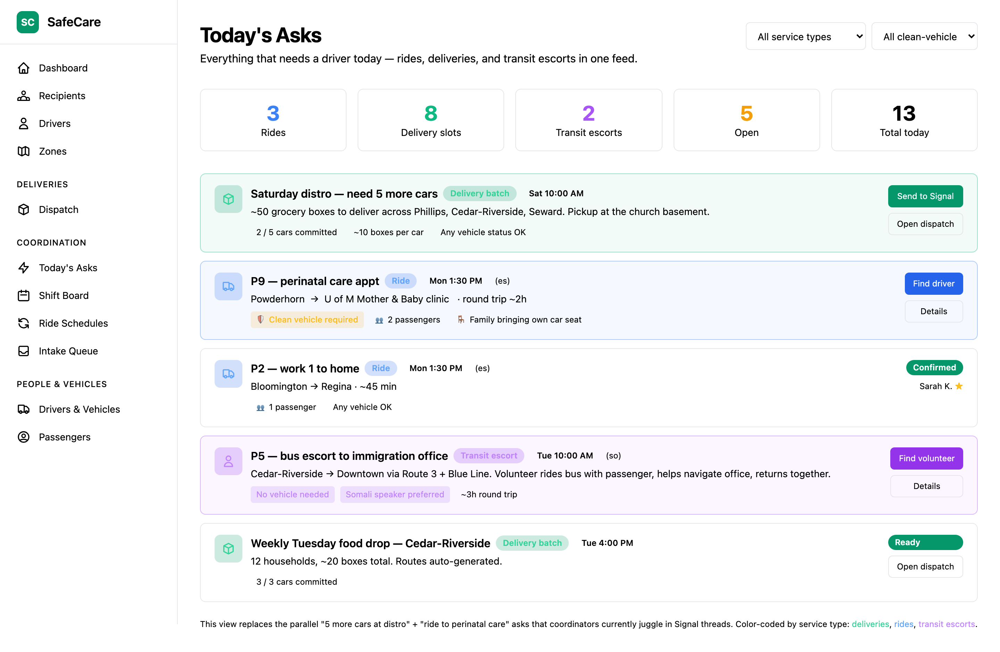
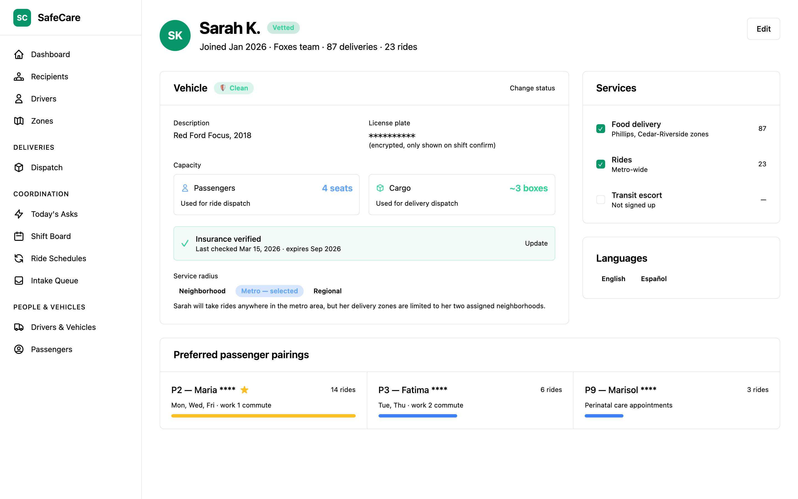
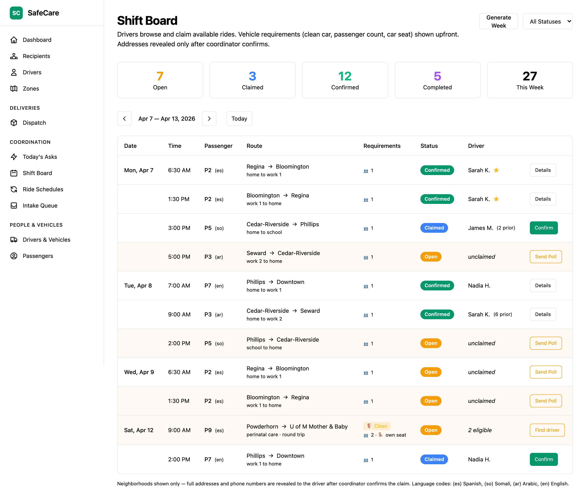
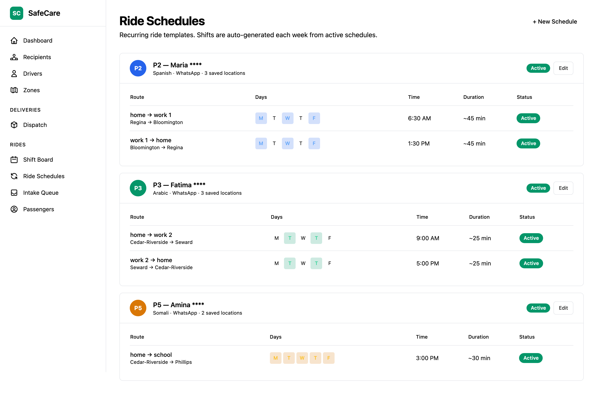
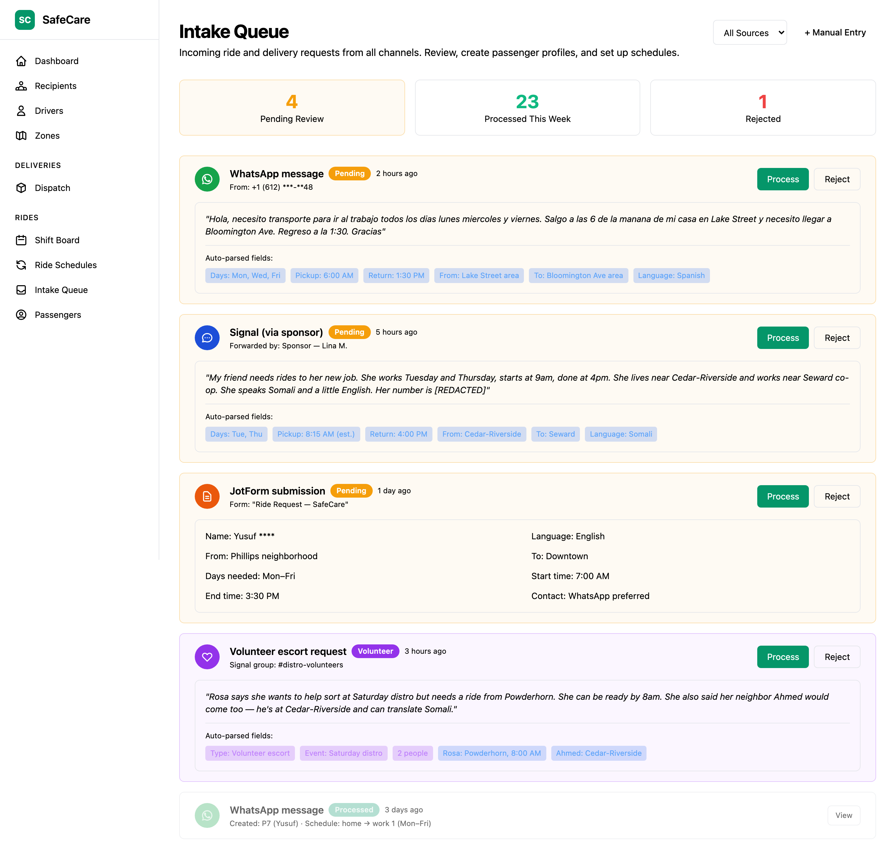
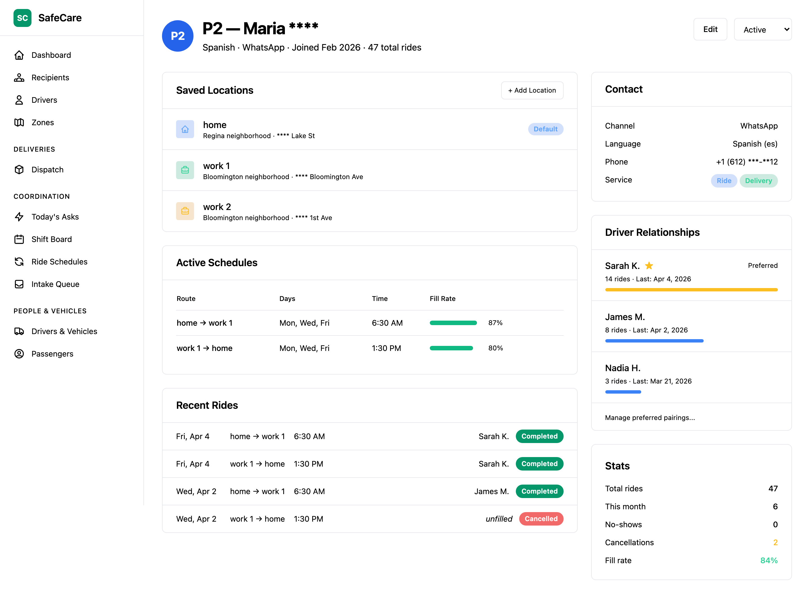

# Ride Coordination — Design Proposal

> **Status: Proposed (refined April 2026)** — Data model v1 is in place, UI is not yet built. The screenshots below are mockups. This document was significantly revised after a second round of coordinator feedback in April 2026 — see "[Refined design — April 2026](#refined-design--april-2026)" below for what changed.

SafeCare is expanding from food delivery to include **mutual aid transportation coordination**: scheduled rides, ad-hoc rides, and public-transit escorts. This was driven by detailed feedback from coordinators in active mutual aid driving groups who currently manage rides through spreadsheets, Signal polls, and WhatsApp messages.

## Why

Coordinators across multiple driving groups are hitting the same bottlenecks:

- **Intake is manual** — ride requests arrive as plain-text WhatsApp or Signal messages, and a coordinator has to manually transcribe each one into a calendar or spreadsheet
- **Scheduling is duplicated** — coordinators maintain parallel spreadsheets for their own tracking and for driver-facing views, with Signal polls filling gaps
- **Privacy is ad-hoc** — drivers share personal cell numbers with passengers and use whatever translation app they can find
- **Relationships matter** — driving groups strongly prioritize ongoing driver-passenger relationships, but current tools don't track or support this
- **Cars get categorized as "clean" or "flagged"** based on whether the vehicle may be recognized, and that determines what jobs each driver can take. Coordinators currently track this in their heads or in side spreadsheets.
- **Same drivers do everything** — there's "quite a lot of double dipping" between rides and food deliveries even when they're coordinated through separate channels. The same Signal group hears "we need 5 more cars to deliver groceries today" and "mom and infant need a ride to perinatal care" within minutes of each other.

SafeCare already solves many of these problems for food delivery (encrypted PII, multi-language notifications, offline maps, blind communication proxy). The same infrastructure applies directly to rides — but the **dispatching model is different**, and rides have security and capacity concerns deliveries don't.

## What's Different from Deliveries

| | Food Delivery | Ride Coordination |
|---|---|---|
| **Assignment** | Coordinator pushes routes to drivers | Drivers browse and claim shifts |
| **Timing** | Same-day batch dispatch | Scheduled days/weeks ahead, or ad-hoc same-day |
| **Recurrence** | One-off per session | Recurring weekly schedules + one-offs |
| **Relationships** | Transactional | Ongoing, preferred pairings |
| **Geography** | **Neighborhood clustered** — drivers cover 1-2 zones, routes are nearest-neighbor sorted | **Metro-wide** — point-to-point or round-trip across the whole region |
| **Capacity axis** | Cargo (bags, boxes) | Passengers (seats) — separate field |
| **Vehicle status** | Doesn't matter | **Critical** — clean vs flagged determines which rides a driver can take |
| **Locations** | Single address per recipient | Multiple named locations (home, work 1, work 2) |
| **Data retention** | Purged within 24 hours | Schedules persist, shift history retained |

Both service types share the same driver pool, notification channels, encryption, and mapping infrastructure — but the matching algorithm and the operator's mental model are very different.

## Proposed Workflows

### Today's Asks — unified dispatch view

A single feed of everything that needs a driver today: deliveries, rides, and transit escorts side by side. This is the view a coordinator opens when they sit down at their desk.



Key elements:
- **Color-coded by service type** — green deliveries, blue rides, purple transit escorts. One coordinator handles all three at once instead of juggling parallel Signal threads.
- **Vehicle requirement chips** — `🛡 Clean` for sensitive trips, `👥 N` for passenger count, `🪑 own seat` for car-seat-bringing families. Coordinators see at-a-glance which jobs are constrained.
- **Delivery batch asks** — the "need 5 more cars at distro" request from Signal becomes a structured ask that coordinators can broadcast or dispatch.
- **Filter by clean-vehicle status** — when triaging sensitive trips, the coordinator can hide non-clean drivers from the matching pool.

### Driver & Vehicle Profile

Per-driver view showing the vehicle status (clean / flagged / unknown), capacity on two axes (passengers AND cargo), insurance status, service radius (neighborhood / metro / regional), service-type opt-ins, and preferred passenger pairings.



Key elements:
- **Vehicle status badge** — Clean / Flagged / Unknown, prominent at the top of the Vehicle card. This isn't a soft preference; it gates which shifts the driver can take.
- **Two capacity axes** — `4 seats` (used by ride dispatch) is independent of `~3 boxes` (used by delivery dispatch). A sedan can carry 4 passengers OR 3 grocery boxes but rarely both at once.
- **Insurance verified** — coordinators want to know they have a current copy of insurance for the drivers covering sensitive trips.
- **Service radius** — `Metro` selected for rides, but the driver's delivery zones are still neighborhood-clustered. Different geography models for the same driver.
- **Service opt-ins** — the driver explicitly opts into food delivery, rides, and/or transit escort. Not signed up for transit escort here, so they won't see those shifts on their board.

### Shift Board (Driver-facing view)

Drivers see a week-ahead board of available rides showing only **neighborhoods and passenger IDs** — no addresses or phone numbers until a coordinator confirms their claim. The Requirements column surfaces clean-vehicle and car-seat needs upfront.



Key elements:
- **Progressive disclosure** — neighborhoods and route labels ("work 1 to home") are visible; full addresses and contact info are revealed only after coordinator approval
- **Preferred pairings** — gold stars indicate driver-passenger relationships the coordinator has flagged as preferred, with prior ride counts
- **Language codes** — visible on each shift so drivers know translation needs upfront
- **Vehicle requirements** — clean vehicle, passenger count, car seat needs displayed in the Requirements column. Drivers whose vehicle doesn't qualify don't see clean-only shifts at all.
- **"Find driver" for unclaimed sensitive trips** — instead of broadcasting to a Signal poll (which leaks the request to non-eligible drivers), coordinators get a curated list of eligible drivers.

### Ride Schedules (Coordinator View)

Recurring ride templates grouped by passenger. Each schedule specifies pickup/dropoff locations, days of week, and time. Shifts are auto-generated each week from active schedules.



Key elements:
- **Multiple locations per passenger** — P2 has "home", "work 1", and "work 2" as saved locations, each in a different neighborhood
- **Route labels** — "home to work 1" appears on the shift board instead of addresses, matching the pattern coordinators already use ("work one to home" instead of "regina to bloomington")
- **Day-of-week selectors** — visual representation of which days each route runs

### Intake Queue (Coordinator View)

Incoming ride requests from any channel — WhatsApp, Signal, JotForm, web form, or manual entry — land in a unified queue. Auto-parsed fields (days, times, neighborhoods, language) are extracted from raw text to reduce coordinator data entry.



Key elements:
- **Multi-channel** — WhatsApp messages, Signal forwards (including via third-party sponsors), JotForm submissions, and volunteer escort requests all appear in one place
- **Auto-parsing** — the system extracts structured fields from unstructured text (days, times, locations, language) so coordinators can review and confirm rather than re-type
- **Volunteer escorts** — requests for rides to distribution events are visually distinguished and tagged separately

### Passenger Detail (Coordinator View)

Per-passenger view showing saved locations, active schedules, ride history, and driver relationship tracking.



Key elements:
- **Saved locations** — home, work 1, work 2 with neighborhood-level labels and encrypted full addresses
- **Driver relationships** — ride counts and preferred-pairing flags for each driver who has driven this passenger, supporting the relationship-building priority
- **Fill rate** — what percentage of scheduled shifts are actually getting claimed, so coordinators can see where coverage is thin
- **Stats** — total rides, no-shows, cancellations for operational awareness

## Data Model

The ride coordination schema is implemented and ready for backend service development. See:

- [`docker/init-db.sql`](../docker/init-db.sql) — full schema (new installs)
- [`docker/migrations/002-ride-coordination.sql`](../docker/migrations/002-ride-coordination.sql) — migration for existing deployments
- [`packages/shared/src/types.ts`](../packages/shared/src/types.ts) — TypeScript interfaces
- [`packages/backend/src/db/schema.ts`](../packages/backend/src/db/schema.ts) — Drizzle ORM definitions

### New Tables

| Table | Purpose |
|---|---|
| `saved_locations` | Multiple named addresses per passenger, encrypted |
| `ride_schedules` | Recurring ride templates (days, times, pickup/dropoff) |
| `shifts` | Individual ride instances with driver-claim lifecycle |
| `driver_passenger_affinity` | Ride counts and preferred-pairing flags |
| `intake_requests` | Multi-channel request queue with parsed fields |

### Shift Lifecycle

```
open → claimed → confirmed → in_progress → completed
  │       │                                     │
  │       └──→ (coordinator rejects) ──→ open   │
  │                                             │
  └──→ cancelled                        no_show ←┘
```

## Refined design — April 2026

After a second round of feedback from an active mutual aid coordinator, several pieces of the original design need revision. The schema additions for these are sketched in [`docker/migrations/004-clean-cars.sql`](../docker/migrations/004-clean-cars.sql) (proposed, not yet committed).

### Vehicle status: clean vs flagged

> "Most people's cars are considered [recognized] or clean/able to be used for driving to sensitive locations or transporting passengers."

This is an operational awareness primitive, not a soft preference. Every driver's vehicle gets one of three status values:

- **Clean** — not associated with mutual aid activity. Can be used for sensitive trips: perinatal care, court, immigration-related appointments, etc.
- **Flagged** — may be recognized or associated with mutual aid activity. Still useful for low-risk grocery deliveries, but should not be used for sensitive rides.
- **Unknown** — newer drivers or status unverified.

**Schema change:** Add `vehicle_status` field to `drivers`. Add `requires_clean_vehicle` flag to `shifts`. The matching algorithm hides clean-only shifts from drivers whose vehicle is flagged or unknown.

### Capacity is two axes, not one

> "I'd wanna know its carrying capacity for cargo and as well as passengers."

The current `max_deliveries` field conflates cargo and passenger capacity. They're independent — a sedan can carry 4 passengers OR ~3 grocery bags but rarely both at once. **Schema change:** Add `passenger_capacity` (seats, excluding driver) to `drivers`, separate from `max_deliveries` (cargo). Add `passenger_count` and `car_seat_required` to `shifts` (the "mom and infant with their own car seat" use case).

### Insurance verification

> "I'd want a list of clean cars owned/insured by good neighbors."

Coordinators want to know whether they have a current copy of each driver's insurance. **Schema change:** Add `insurance_verified` and `insurance_notes` fields to `drivers`. Surfaces in the driver profile and the dispatcher's view but doesn't gate dispatch by default.

### Rides are metro-wide, not neighborhood-clustered

> "For rides though it often makes less sense to go hyperlocal — metro wide coordination might work especially with some point-to-point requests and some round trip."

The original design used the same `delivery_zone_ids` field for both deliveries and rides. That's correct for deliveries (which cluster by neighborhood) but actively wrong for rides — a Phillips driver should be allowed to take a ride from Seward to Bloomington without zone gymnastics. **Schema change:** Add `service_radius` to `drivers` (`neighborhood | metro | regional`). The ride dispatch algorithm filters by service radius rather than zones. Delivery dispatch keeps the existing zone-based path.

### Transit escort as a third service type

> "Sometimes ppl request someone to ride bus or public transit with them."

A volunteer accompanying someone on public transit isn't a ride and isn't a delivery. It needs no car and ignores vehicle status entirely — what matters is schedule fit, language match, and physical mobility. **Schema change:** Add `transit_escort` to the `service_types` enum. Transit escort shifts have a separate icon and don't show vehicle requirements.

### Unified dispatch view (deferred to design phase)

> "A lot of requests get floated to the same neighborhood groups (e.g. 'need 5 more cars to deliver groceries today' + 'mom and infant need a ride to perinatal care appointment' are likely to be asks put out to similar groups)."

Coordinators today juggle these in one Signal group. The original design would have split rides and deliveries into two separate dashboard screens. The refined design proposes a **unified "Today's Asks" board** that surfaces deliveries, rides, and transit escorts in one feed, color-coded by service type, filterable by time / status / vehicle requirement. This is a UI-only change — the schema already supports it.

### What I'd push back on

- **Volunteer-needs-ride-to-distro tracking:** I had this in the original mockup but the coordinator said it "happens somewhat organically on site" — building dedicated tracking adds admin load instead of reducing it. Removed from the refined design.
- **Hyperlocal ride matching:** see "metro-wide" above. The original schema had rides inheriting `delivery_zone_ids` filtering — that needs to go.

## What's Not Built Yet

To be clear about current status:

- **Data model v1** — Done (migration `002-ride-coordination.sql`, Drizzle schema, TypeScript types)
- **Data model v2 — clean cars + transit escort + capacity split** — Sketched in [`docker/migrations/004-clean-cars.sql`](../docker/migrations/004-clean-cars.sql), not yet committed
- **Backend services** — Not started (CRUD, shift generation, claim/confirm flow, affinity tracking, intake processing)
- **API routes** — Not started
- **Dashboard UI** — Not started (the screenshots above are static HTML mockups)
- **Driver PWA integration** — Not started (shift board in the driver app)
- **Notifications** — Not started (shift claim alerts, day-before passenger messages)
- **Blind communication proxy** — Schema exists, proxy logic not implemented (needed for both deliveries and rides)

## Regenerating Mockup Screenshots

```bash
node docs/mockups/capture-screenshots.mjs
```

Requires `puppeteer-core` (already in devDependencies) and Chrome installed. The interactive mockup is at [`docs/mockups/ride-coordination.html`](mockups/ride-coordination.html).
