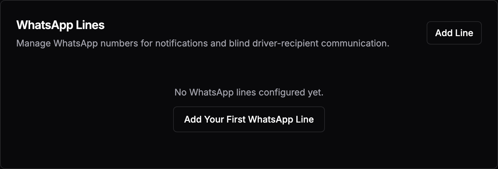
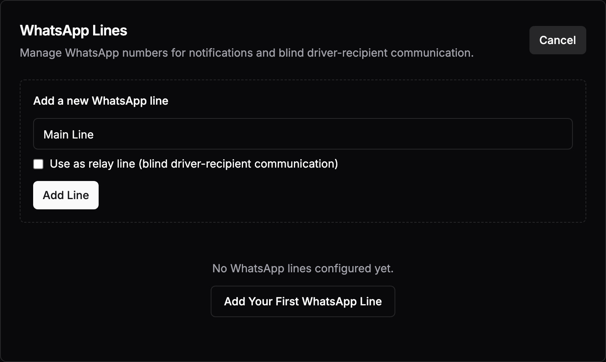
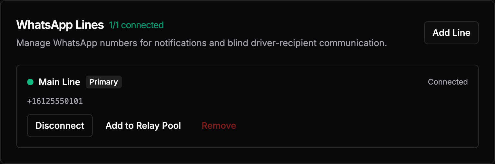
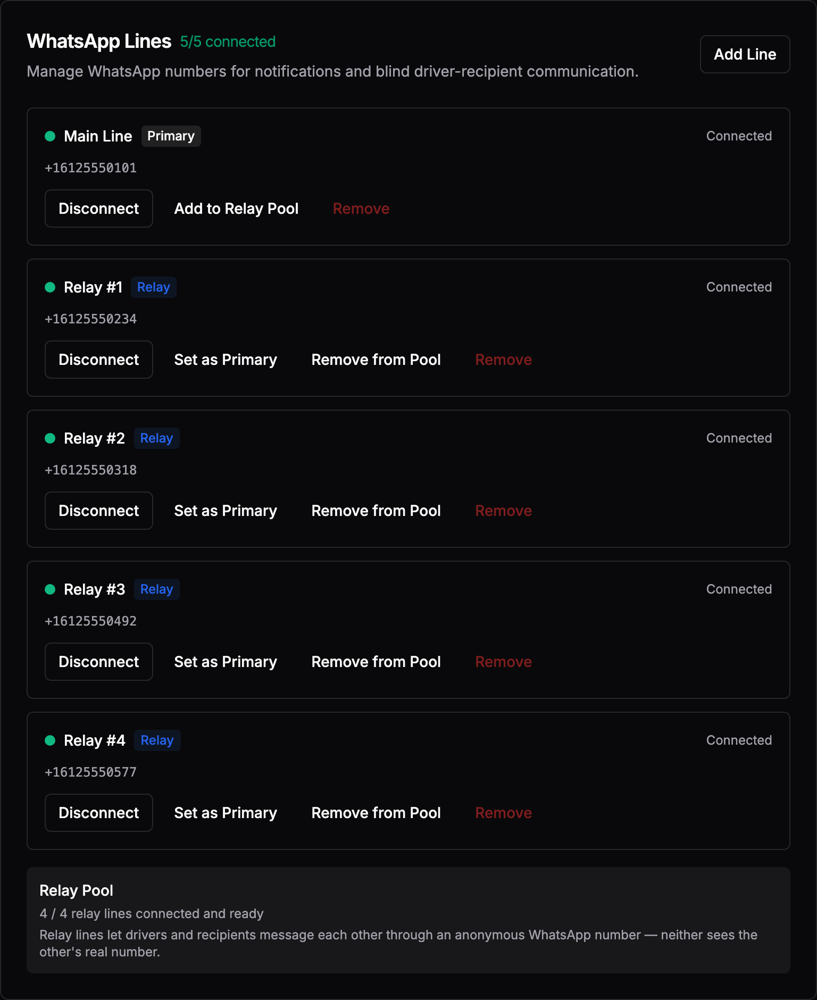

# WhatsApp Setup Guide: 5 Prepaid SIMs, One Phone

A step-by-step walkthrough for setting up SafeCare's WhatsApp messaging with
five prepaid SIM cards and a single phone. Written for non-technical users —
no prior knowledge required.

When you finish, you will have:

- **1 primary line** that sends delivery notifications to recipients
- **4 relay lines** that drivers and recipients can use to message each other
  anonymously (neither sees the other's real number)

Total cost: about **$25-50** (one-time). Total time: about **90 minutes**.

---

## What You Need

**Hardware**
- 1 spare smartphone (Android or iPhone — even an old one works)
- Wi-Fi at the location where you'll do the setup
- Your SafeCare computer with the dashboard open

**Money**
- 5 prepaid SIM cards: $3-10 each (~$25-50 total)

**Important to understand**
- You do **not** need a phone plan or monthly service for any of these SIMs.
- Each SIM only needs to receive **one** SMS verification code from WhatsApp.
- After that, the SIM can sit in a drawer forever — WhatsApp keeps working
  through SafeCare over Wi-Fi.

---

## Part 1: Buy 5 SIM Cards

**Where:** Walmart, Target, Best Buy, a gas station, a dollar store, or any
store that sells phones.

**What to buy:** The cheapest prepaid SIM cards they have. Good options:
- Tracfone ($5-10)
- T-Mobile prepaid ($10)
- AT&T prepaid
- Mint Mobile

**At the store, say:** *"I need five of the cheapest prepaid SIM cards you
have. I do not need a plan."*

**Do not** let them upsell you on a monthly plan. You only need the SIM card
itself.

When you get home, lay the 5 packages out on a table. Get a piece of paper
and number them **1 through 5**. You'll write each phone number next to its
SIM number as you go.

**Time: ~30 minutes (one shopping trip)**

---

## Part 2: Set Up Each SIM (Repeat 5 Times)

You will do this exact sequence **five times**, once for each SIM. Each cycle
takes about 10 minutes.

The phone stays the same. Only the SIM and the WhatsApp registration change.

### The Cycle (~10 minutes per SIM)

#### Step 1: Activate the SIM (~3 minutes)

1. Open the SIM #1 package.
2. Find the activation card inside — it has a phone number to call OR a
   website to visit.
3. Call the number or open the website on any device.
4. Follow their prompts. They'll ask for the SIM's serial number, which is
   printed on the plastic card the SIM came on.
5. They'll give you a phone number. **Write it down next to "SIM #1" on
   your paper.**

#### Step 2: Insert the SIM into the phone

6. Power off the phone.
7. Open the SIM tray (use a paperclip in the small hole on the side).
8. Take out any SIM that's already there.
9. Put SIM #1 in the tray.
10. Close the tray and turn the phone back on.
11. Wait 1-2 minutes. You should see signal bars appear at the top of the
    screen, and possibly a "Welcome to [Carrier]" text message.

#### Step 3: Register WhatsApp with this number (~3 minutes)

12. Open **WhatsApp** on the phone.
    - **First time only:** If WhatsApp isn't installed yet, install it from
      the Play Store (Android) or App Store (iPhone) first. After that, you
      will never need to install it again.
13. WhatsApp will ask for your phone number. Enter the number from your paper
    for SIM #1. Tap **Next**, then **OK** to confirm.
14. WhatsApp sends a 6-digit code via SMS. It usually auto-fills. If it
    doesn't, open the Messages app, find the SMS, and type the code in.
15. WhatsApp asks for a profile name. Type something like **"SafeCare 1"**.
    Skip the profile photo.
16. You're now in WhatsApp, registered to SIM #1's number.

#### Step 4: Link this number to SafeCare (~2 minutes)

17. **On your SafeCare computer**, open the dashboard in your browser.
18. Click **Settings** in the menu.
19. Scroll down to **WhatsApp Lines**. On a fresh install it will look
    like this:

    

20. Click **"Add Line"**. A form appears:

    
21. Type a label:
    - **For SIM #1:** type `Main Line`. Leave the "Use as relay line"
      checkbox **unchecked**.
    - **For SIMs #2 through #5:** type `Relay #1`, `Relay #2`, etc. **Check**
      the "Use as relay line" checkbox.
22. Click **"Add Line"**.
23. The new line appears in the list. Click **"Connect"** next to it.
24. After a couple seconds, a **QR code** appears on your computer screen.
25. **On the phone**, in WhatsApp:
    - Tap the **three-dot menu** in the top right (Android) or **Settings**
      tab at the bottom right (iPhone).
    - Tap **"Linked Devices"**.
    - Tap **"Link a Device"**.
    - The phone's camera turns on.
26. **Point the phone's camera at the QR code on your computer screen.**
27. After 1-2 seconds the phone says "Linking…" and then closes.
28. **On your computer**, the line in SafeCare turns green with a checkmark.
    The phone number appears under the label, like this:

    

✅ **SIM #1 is done.** This number is now permanently linked to SafeCare and
will keep working forever, even after you remove the SIM.

#### Step 5: Log out of WhatsApp on the phone (~1 minute)

This is the step that lets you reuse the same phone for the next SIM.

29. **On the phone**, in WhatsApp:
    - Tap the **three-dot menu** (top right) → **Settings**.
    - Tap **Account**.
    - Tap **Delete My Account**.
    - Enter the phone number you just registered (SIM #1's number).
    - Tap **Delete My Account** to confirm.

> **Don't worry — this does not break SafeCare.** "Delete My Account" only
> removes the number's registration from this phone. Your linked device in
> SafeCare keeps working perfectly. SafeCare talks to WhatsApp's servers
> directly and doesn't need the phone anymore.

30. WhatsApp will close itself. The phone is now ready for the next SIM.

#### Step 6: Power off and swap SIMs

31. Power off the phone.
32. Open the SIM tray.
33. Remove SIM #1. **Put it back in its original package** so you don't lose
    track of which one is which.
34. Insert **SIM #2**.
35. Power on the phone.

### Now repeat steps 1-6 for SIMs #2, #3, #4, and #5.

For SIMs #2-#5, remember to **check the "Use as relay line" checkbox** in
SafeCare when adding them.

After SIM #5, **do not** delete the WhatsApp account on the phone. Just leave
it. You're done.

---

## Part 3: Verify Everything Works

When all 5 SIMs are linked:

1. Go back to **Settings → WhatsApp Lines** in SafeCare.
2. You should see 5 lines, all with **green dots** next to them, plus the
   **Relay Pool** status at the bottom reading `4 / 4 relay lines connected
   and ready`:

   

If any line shows a gray dot, click **"Connect"** next to it. It should
reconnect automatically using the saved link from earlier.

---

## What to Do With the Phone and SIMs Afterward

**The phone:**
You don't need it anymore for day-to-day operation. SafeCare talks to
WhatsApp's servers directly. You can:
- Put the phone in a drawer as a backup
- Use it for something else
- Give it back to whoever loaned it to you

**The 5 SIM cards:**
Put them in a labeled envelope (`SafeCare WhatsApp SIMs - Lines 1-5`) and
store somewhere safe. You will only need them again if:
- You want to re-link a number after a long disconnect
- A number gets banned and you want to swap in a fresh one

---

## Total Time Budget

| Task                              | Time per SIM | Total (5 SIMs) |
|-----------------------------------|--------------|----------------|
| Shopping trip                     | —            | ~30 min        |
| Activate SIM                      | ~3 min       | ~15 min        |
| Insert SIM, wait for signal       | ~2 min       | ~10 min        |
| Register WhatsApp                 | ~3 min       | ~15 min        |
| Link to SafeCare                  | ~2 min       | ~10 min        |
| Log out, swap SIM                 | ~2 min       | ~10 min (4×)   |
| **Total**                         |              | **~90 min**    |

---

## Troubleshooting

**The activation website asks me for an address or credit card.**
You're on the wrong page — they're trying to sell you a plan. Look for
"Activate" or "Bring your own phone" instead. If stuck, call the activation
number printed on the SIM card directly.

**WhatsApp says "This phone number is banned from using WhatsApp."**
Some prepaid numbers (especially recycled ones) are pre-banned. Toss this
SIM and use a fresh one. This is rare but happens.

**The phone shows "No service" after inserting a new SIM.**
Wait 5 more minutes. If still no signal, try restarting the phone. If still
no signal, the SIM may not be activated yet — check your activation
confirmation.

**SafeCare says "Connection closed" after I scan the QR code.**
Click **"Connect"** again on the line. Sometimes the first link attempt
times out. The second attempt almost always works.

**The QR code on my computer disappeared before I could scan it.**
Click **"Connect"** again to generate a fresh QR code. The codes expire
after ~30 seconds.

**I accidentally chose "Delete My Account" before linking to SafeCare.**
No harm done. Just register WhatsApp with the same number again (you'll
need a new SMS code). Then link to SafeCare.

**I lost track of which SIM is which.**
Open SafeCare's WhatsApp Lines page — each connected line shows its phone
number. Cross-reference with the numbers you wrote on your paper.

---

## Why This Setup?

**Why 5 numbers?**
- **1 primary** sends delivery notifications. If WhatsApp ever bans this
  number (rare), the other 4 keep working.
- **4 relay lines** let drivers and recipients message each other through
  an anonymous number. Neither party sees the other's real phone number,
  protecting privacy.

**Why prepaid SIMs and not VoIP numbers (like Google Voice or TextNow)?**
WhatsApp blocks most VoIP numbers from registering. Real prepaid SIMs work
reliably and cost almost nothing.

**Why not use the WhatsApp Business API?**
That requires business verification with Meta, paperwork, monthly fees, and
weeks of setup. The prepaid SIM approach is the fastest, cheapest, and most
private way for a small mutual aid organization to get running.

**What if a relay number gets banned?**
Buy one new prepaid SIM ($5), repeat the cycle for that one number, and
remove the banned line from SafeCare's pool. Total downtime: ~15 minutes.
The other relay lines keep working the whole time.
